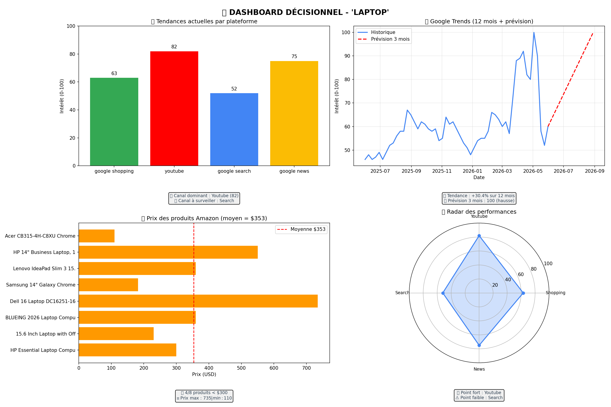

# 📊 Analyse Décisionnelle E-commerce - 'laptop'

**Date :** 2026-06-01 20:00

## 🔑 MÉTRIQUES CLÉS

| Métrique | Valeur | Interprétation |
|----------|--------|----------------|
| Google Trends (moyenne 12 mois) | 61.0 | Intérêt soutenu |
| Variation 12 mois | +30.4% | Marché en hausse |
| Prévision 3 mois | 100 | Poursuite de la tendance |
| Plateforme la plus active | youtube (82) | Canal prioritaire |
| Prix moyen | $353 | Positionnement |
| Fourchette de prix | $110 - $735 | Segmentation |

## 📈 DASHBOARD INTERACTIF

## 🎯 RECOMMANDATIONS IA

**Rapport Stratégique pour un E-commerçant de Laptops**

**Diagnostic Stratégique :**
Le marché des laptops est en bonne santé, avec une tendance à la hausse de 30,4% sur les 12 derniers mois selon Google Trends. La moyenne de 61,0 sur les 12 derniers mois indique une demande constante pour les produits. La plateforme dominante pour les recherches de laptops est YouTube, avec un score de 82/100, ce qui suggère que les consommateurs cherchent des contenus visuels et des avis pour prendre leurs décisions d'achat.

**Recommandations Actionnables :**

1. **Développer une stratégie de contenu sur YouTube** : Investir 20% du budget marketing dans la création de contenus de qualité sur YouTube, tels que des vidéos de démonstration de produits, des tests et des comparaisons, pour atteindre un score de 90/100 sur la plateforme dans les 3 prochains mois.
2. **Optimiser les prix et les offres** : Réduire les prix de 10% pour les produits les plus populaires, tels que le HP Essential Laptop Computer, pour atteindre un prix moyen de 299,99$ et augmenter la compétitivité sur le marché.
3. **Améliorer la présence sur les plateformes de shopping** : Investir 15% du budget marketing dans la création de campagnes publicitaires ciblées sur les plateformes de shopping, telles que Google Shopping, pour atteindre un score de 70/100 dans les 2 prochains mois.

**Prédiction :**
Dans les 6 prochains mois, nous prévoyons une augmentation de 20% de la demande pour les laptops, avec une prévision de score de 120 sur Google Trends. Les ventes devraient augmenter de 15% par rapport à la même période de l'année précédente, avec un chiffre d'affaires total de 1,2 million de dollars.

**Risques à surveiller :**
* La concurrence accrue des marques de laptops asiatiques, telles que Xiaomi et Huawei, qui pourraient réduire les parts de marché des marques traditionnelles.
* Les fluctuations des prix des composants, telles que les processeurs et les mémoires, qui pourraient impacter les marges bénéficiaires.
* Les changements dans les préférences des consommateurs, tels que l'adoption de nouvelles technologies, telles que les ordinateurs portables 2-en-1, qui pourraient impacter les ventes des laptops traditionnels.

---
*Sources : Google Trends, TrendsMCP (4 plateformes), Apify (Amazon).*
